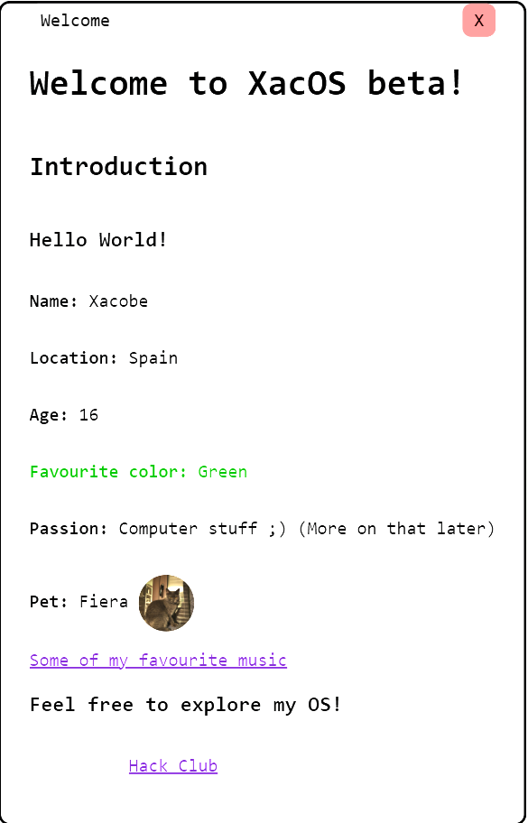

# XacOS

This is a very bare-bones WebOS simulator to present myself.
The main objective was to learn HTML, JavaScript and CSS, so expect the code to be a mess...

# Hack Club
Huge thanks to hack club!
This was made following their WebOS Jam
https://jams.hackclub.com/batch/webOS

# Functions

## Welcome screen

The first screen that you encounter when starting up. (You can also open it clicking XacOS in the taskbar) 
It is the main introduction to myself, citing some facts about me.

## Projects app

Here yu can explore a couple of projects I've made by double clcking the icons

## Settings app

For now, you can only change the wallpaper, but more options will come in the next version

## Taskbar
The taskbar shows the time, the OS name and the icons of your open programs.
You can click them to bring up the window
